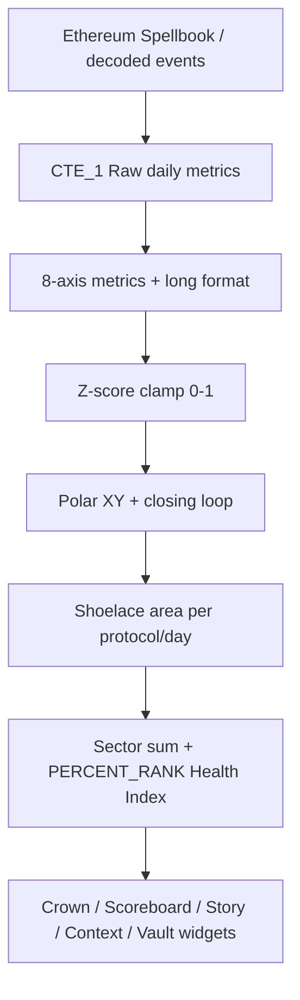

# Architecture

## Product shape (pstack usage-first)

```text
Reader opens Dune page
  → sees Crown radar in <5s
  → reads Health Index band (Weak/Soft/Strong/Hot)
  → drills Story / Context / Vault if needed
```

Code and SQL exist to serve that path. Anything that blocks the path (cryptic codes, missing glossary, param rot) is a defect.

## Layers



## Ownership

| Concern | Owner artifact |
|---------|----------------|
| Live layout + copy | Dune dashboard `216253` |
| SQL truth | Queries under `sql/` (IDs in filenames) |
| VI zone contract | `docs/visual-intelligence.md` + `docs/live-dashboard-snapshot.json` |
| Band math | `docs/health-index.md` + query `7997419` |
| UI-only colors | `docs/color-palette.md` (never in SQL) |

## Query roles

| ID | Role | Consumers |
|----|------|-----------|
| 7995136 | Master radar (+ legacy widget router) | Crown radar viz |
| 7997414 | Plain-language scoreboard | WHO LEADS, HEALTH INDEX, MOMENTUM, MARKET PULSE |
| 7997418 | Anomaly sentinel | ANOMALY card |
| 7997419 | Health Index time series + band fills | Story area chart |
| 8034055 | 7d Rising/Softening + band | Story badges |
| 7997415 | Single-axis ranking | Context bars + AXIS LEADER |
| 7997416 | Full axis×protocol matrix | Vault audit |
| 7995854 | Latest block + query time | Vault heartbeat |

## Why split queries (not one mega-router)

The original master query (`7995136`) still contains a `{{widget}}` router for radar/kpi/decomp/audit/anomaly/playback. Production panels prefer **dedicated queries** so:

1. Scoreboard copy can say `68 · Strong` without fighting the radar schema.
2. Health Index chart can ship stacked band fills without polluting Crown columns.
3. Param `decomp_axis` can target Context without re-running the full radar router.

Legacy `widget` param may still appear on the dashboard filter row — see `docs/parameters.md`.

## Zone → row map (live 2026-07-28)

| Zone | Rows (approx) |
|------|----------------|
| Filters | 0 |
| Banner | 1–5 |
| Crown radar | 6–19 |
| Crown subtitle | 20–21 |
| Scoreboard | 22–26 |
| Story subtitle | 27–28 |
| Story badges | 29–32 |
| Story chart + Context | 33–42 |
| Glossary | 43–48 |
| Vault note | 49–50 |
| Audit | 51–58 |
| Heartbeat | 59–61 |

Exact widget IDs: `docs/live-dashboard-snapshot.json`.
